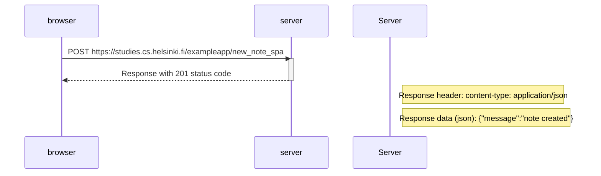

```mermaid
sequenceDiagram
    participant browser
    participant server
    
    browser->>server: POST https://studies.cs.helsinki.fi/exampleapp/new_note_spa
    activate server
    server-->>browser: Response with 201 status code
    deactivate server
        
    Note right of Server: Response header: content-type: application/json
    Note right of Server: Response data (json): {"message":"note created"}
``` 